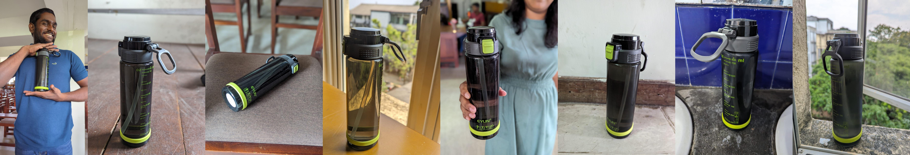
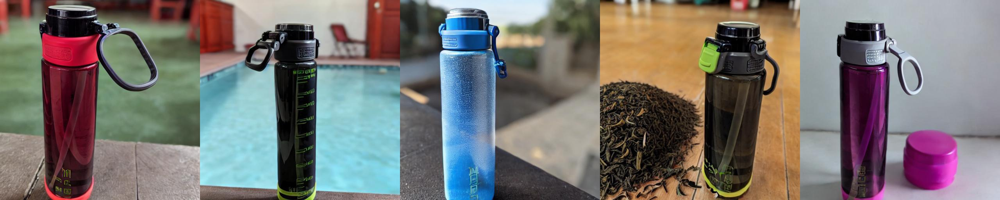
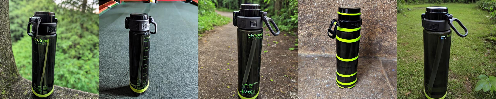
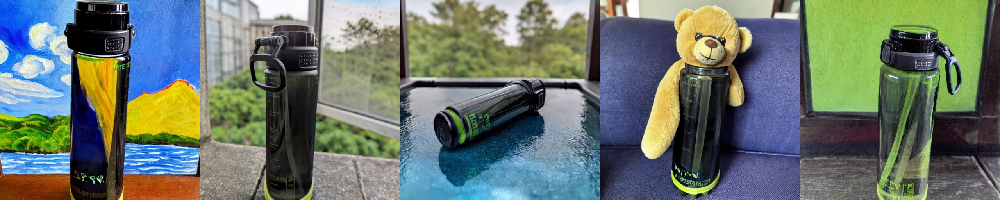
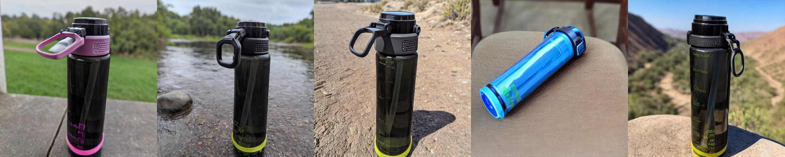

# Dreambooth

## Setup

### Create the Environment

Create the anaconda environment `sd` from the following command and activate it.

```bash
conda create -f environment.yaml
conda activate sd
```

### Download the model weights

The official weights of Stable Diffusion V1 can be downloaded from Huggingface using the `sd-weights.sh` script.

```bash
bash download/sd-weights.sh
```

## Stable Diffusion

This implementation is based on the ["High-Resolution Image Synthesis with Latent Diffusion Models"](https://arxiv.org/abs/2112.10752) paper that was published at CVPR 2022. This Stable Diffusion implementation only focuses on sampling text-to-image and image-to-image processes.

### Usage

#### Text2Image

Use the script `txt2img.py`

```bash
python txt2img.py -p "Hide the pain Harold drinking tea" -v 4
```

##### Results


#### Image2Image

Use the script `img2img.py`

```bash
python img2img.py -i imgs/bear.jpg -p "A realistic bear in it's natural habitat under the moon light. Cinematic lighting" -v 4
```

##### Results


### Acknowledgments

Please note that most of the source codes are burrowed from the [official Stable Diffusion Repository](https://github.com/CompVis/stable-diffusion).

## Dreambooth

Dreambooth is an algorithm for fine-tuning text-to-image diffusion models for subject-driven generation. This was a work by Google Research in 2023. Dreambooth personalizes a diffusion model by "implanting" a (unique identifier, subject) pair to the model's output space using a very small set of subject images.

To start the training, users will have to collect a set of images of the subject and determine a suitable class name. Once they have been satisfied, users can invoke the Dreambooth script at `dreambooth.py`. For example,

```bash
python dreambooth.py -c "water bottle" -i data/other/bottle -s 200 -l 1.5 --learning-rate 1e-5 --iterations 3000
```

Finetuning a diffusion model can be unstable. The precise amount of training iterations can be different from subject to subject. Hence, it is recommended to use the `--save-every` (`-s`) flag in the above script to save multiple checkpoints throughout the training. Also, users may have to experiment with the best values for the hyperparameters depending on their images.

After this training, the subject will be known by the diffusion model with the name "sks" (This 'rare-token' is hard coded in this implementation). Now with these trained weights, users may invoke the inferencing script [`txt2img.py`](#text2image) while providing the path of the newly trained weights using the flag `--ckpt-path` (`-c`). For ease of usage, the `--ckpt-path` accepts directories containing a set of checkpoints. So users may directly invoke inferencing jobs on multiple checkpoints straight away to evaluate their performance.

Depending on the GPU RAM, users may select to also train the text encoder (using the `-t` flag) and select training in a higher precision (using the `--precision` flag) to obtain better results.

### Results

A Stable Diffusion model was trained using the Dreambooth algorithm. The learning rate was set to $10^{-5}$ and $\lambda$ was set to 1.5. Due to computational limitations, the CLIP encoder was kept unchanged. The model was trained up to 700 iterations. From there on, weights were saved until 725 with intervals of 5 resulting in 6 checkpoints. It was observed that for different prompts, different checkpoints within this set performed well. The training process took a total of 25 minutes on an Nvidia 24 GB Quadro RTX 6000 graphics card.



    Input images






    Generated images

# Links

This implementation was done as a part of two presentations that I did for the In19-S8-EN4583 - Advances in Machine Vision course at the University of Moratuwa, Sri Lanka on 08.03.2024 and 21.03.2023.

1. Stable Diffusion presentation slides: [Google Slides](https://docs.google.com/presentation/d/1iFG2YcA_882saTy_V03Bef8Z6j_6MNSzTbhPkyAL5Zs/edit?usp=sharing).
2. Stable Diffusion presentation recording: [YouTube](https://youtu.be/QFCU1_hAQvs?si=2-3Hg6iTfS1Fcdd1).
3. Dreambooth presentation slides: [Google Slides](https://docs.google.com/presentation/d/1AtYPYbN2zTofNovgBo15sMw0G9SmAA8K4s7w-fzIwKg/edit?usp=sharing)
4. Dreambooth presentation recording: [YouTube](https://youtu.be/IYYJKSrsJgc?si=muVEfiMvhuTxaUPw)

# Acknowledgments

This implementation would have not been possible except for the computational power that was accessible to me through the Aberdeen server at the Department of Electronic and Telecommunication Engineering, University of Moratuwa, Sri Lanka. All the training and inferencing were done on a single Nvidia 24 GB Quadro RTX 6000 graphics card.
