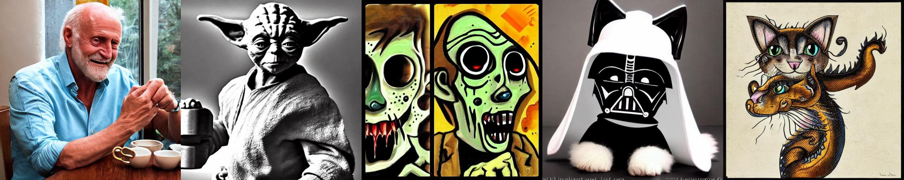
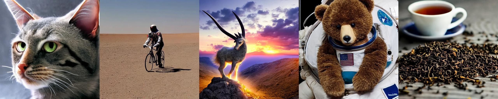
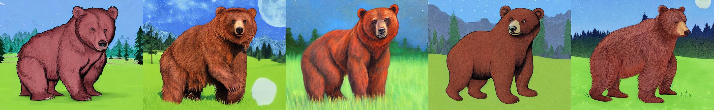

# Dreambooth Re-Implementation with Pytorch

## Setup

### Create the Environment

Create the anaconda environment `sd` from the following command and activate it.

```bash
conda create -f environment.yaml
conda activate sd
```

### Download the model weights

The official weights of Stable Diffusion V1 can be downloaded from Huggingface using the `sd-weights.sh` script.

```bash
bash download/sd-weights.sh
```

## Stable Diffusion

This implementation is based on the ["High-Resolution Image Synthesis with Latent Diffusion Models"](https://arxiv.org/abs/2112.10752) paper that was published at CVPR 2022. This Stable Diffusion implementation only focuses on sampling text-to-image and image-to-image processes.

### Usage

#### Text2Image

Use the script `text2img.py`

```bash
python text2img.py -p "Hide the pain Harold drinking tea" -v 4
```




#### Image2Image

Use the script `img2img.py`

```bash
python img2img.py -i imgs/bear.jpg -p "A realistic bear in it's natural habitat under the moon light. Cinematic lighting" -v 4
```



### Acknowledgments

This implementation was done as a part of a presentation that I did for the In19-S8-EN4583 - Advances in Machine Vision course at the University of Moratuwa, Sri Lanka on 08.03.2024. The presentation slides are publicly available as Google Slides [here](https://docs.google.com/presentation/d/1RrTQyCvUV6plWNxye6esFkVPys1SLfNfby9kjFkx8fQ/edit?usp=sharing).

Also, please note that most of the source codes are burrowed from the [official Stable Diffusion Repository](https://github.com/CompVis/stable-diffusion).

# Dreambooth

Coming soon
